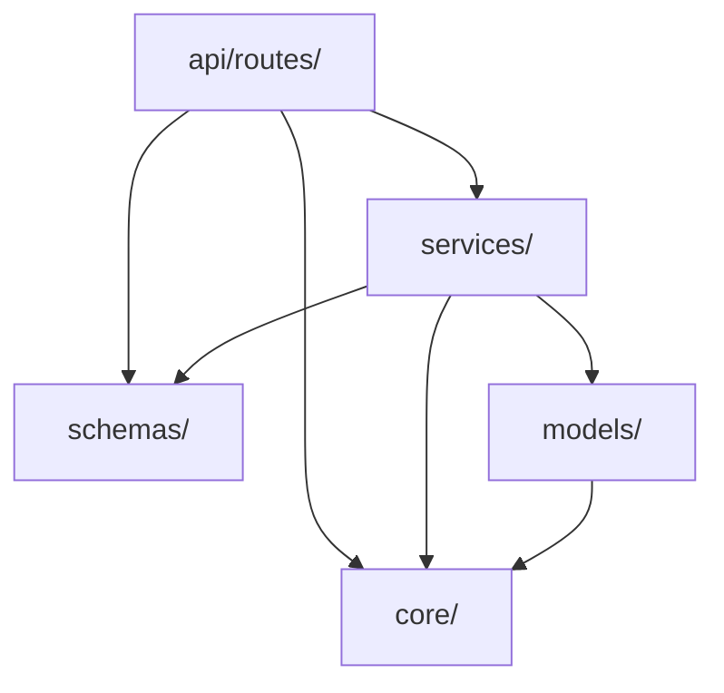

# Layer Boundaries

TarmacView's backend follows a four-layer architecture with strict unidirectional dependencies. The frontend is a separate application communicating exclusively via REST.

## Backend Layers

```
┌─────────────────────────────────────────────┐
│  api/routes/         (HTTP layer)           │
│  Request parsing, auth, response formatting │
├─────────────────────────────────────────────┤
│  schemas/            (Contract layer)       │
│  Pydantic DTOs shared across layers         │
├─────────────────────────────────────────────┤
│  services/           (Business logic layer) │
│  Trajectory, safety validation, export      │
├─────────────────────────────────────────────┤
│  models/             (Data access layer)    │
│  SQLAlchemy ORM, geometry as WKT strings    │
├─────────────────────────────────────────────┤
│  core/               (Infrastructure)       │
│  Config, database session, auth utilities   │
└─────────────────────────────────────────────┘
```

## Dependency Rules



### What Each Layer May Import

| Layer | May Import | Must Not Import |
|---|---|---|
| `api/routes/` | schemas, services, core | models (never query DB directly) |
| `schemas/` | standard library, pydantic | routes, services, models, core |
| `services/` | models, schemas, core | routes |
| `models/` | core (Base, engine) | routes, services, schemas |
| `core/` | standard library, third-party | routes, services, models, schemas |

### Key Constraints

- **Routes are thin.** A route function deserializes the request via a Pydantic schema, calls one or two service functions, and returns a Pydantic response. No SQLAlchemy queries, no business logic.

- **Services own domain logic.** Trajectory generation, safety zone validation, inspection planning, and export formatting all live in service modules. Services receive a database session via dependency injection and query models directly.

- **Models are pure mappings.** SQLAlchemy model classes define table structure and relationships. They do not contain business methods beyond basic property accessors.

- **Schemas are shared but independent.** Pydantic schemas define the API contract. They can be imported by routes (for request/response typing) and services (for structured data passing), but they never import from application code.

- **Core is infrastructure.** Database session factory, settings, auth utilities, and shared dependencies. Core modules are importable by any layer but import nothing from the application layers above.

## Frontend Layers

```
┌─────────────────────────────────────────────┐
│  pages/              (View layer)           │
│  Route-level components, page layout        │
├─────────────────────────────────────────────┤
│  components/         (UI layer)             │
│  Reusable components, map viewers, forms    │
├─────────────────────────────────────────────┤
│  api/                (Data access layer)    │
│  Axios client, JWT interceptor, API calls   │
├─────────────────────────────────────────────┤
│  types/              (Contract layer)       │
│  TypeScript interfaces mirroring schemas    │
└─────────────────────────────────────────────┘
```

### Frontend Dependency Direction

- Pages import components and API functions
- Components import types and may call API functions
- API layer imports types for request/response typing
- Types import nothing — they are pure interface definitions

## Critical Paths (T3)

Certain service modules carry elevated risk because they implement the core thesis algorithm or affect flight safety:

| Module | Risk | Reason |
|---|---|---|
| `services/trajectory*` | T3 | Core trajectory generation algorithm |
| `services/safety_validator*` | T3 | Safety zone collision detection |
| `services/flight_plan*` | T3 | Mission output and waypoint sequencing |
| `migrations/versions/*` | T3 | Database schema changes |

These files require full test coverage and mandatory human review before merge. See `harness.config.json` for the complete risk tier mapping.

## Anti-Patterns to Avoid

- **Fat routes**: putting query logic or business rules in route handlers instead of services
- **Model methods**: adding complex business logic to SQLAlchemy model classes
- **Schema imports in models**: models should never depend on Pydantic schemas
- **Direct DB access in routes**: always go through a service, even for simple lookups
- **Cross-layer imports**: services must not import from routes; models must not import from services
