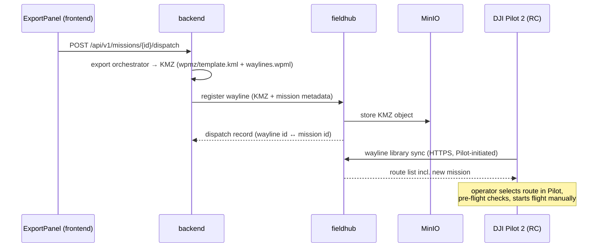
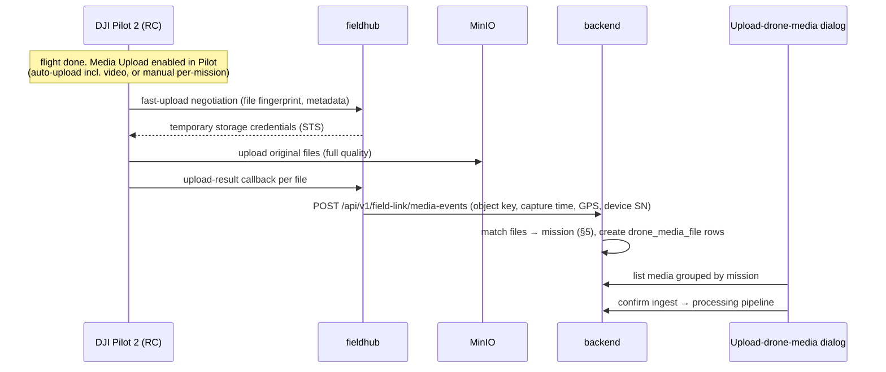

# Field Hub — Local DJI Cloud API Gateway

Wireless mission dispatch to DJI controllers and automatic full-quality media
return, fully offline-capable, integrated with the dockerized TarmacView stack.

Status: **Phase 1 merged** (#818 foundation, #822 protocol slice) — compose
profile `field` (fieldhub + EMQX + MinIO) with TLS cert tooling
(`scripts/field-hub/gen-certs.sh`), the Cloud API access/binding surface
(`/manage/api/v1`: Pilot login, device list, bind/unbind, topology), the
MQTT listener tracking device topology and TTL-based online state in a
postgres device registry (own `fieldhub` schema), the shared-secret internal
status endpoint, the backend proxy `GET /api/v1/field-link/status`, and the
RC link status chip in `ExportPanel`; see `fieldhub/README.md` for how to
run it. **Media return hub side merged** (#824, first Phase 3 slice) — STS
credential issuing, fast-upload/tiny-fingerprints dedupe, upload callbacks
persisting to the hub media registry, and the backend ingest endpoint
`POST /api/v1/field-link/media-events` creating `drone_media_file` rows as
`RECEIVED`. **Mission dispatch merged** (#825, Phase 2, §4.2) — *Send to
drone* in the export panel, the backend dispatch endpoint
`POST /api/v1/missions/{id}/dispatch` + `wayline_dispatch` table, and the
hub's wayline library (`/wayline/api/v1`, pilot-token gated) that Pilot 2
syncs its route list from, with KMZ objects in MinIO served via presigned
URLs. **Media→mission matching + upload dialog merged** (#828, rest of
Phase 3, §5/§6) — the backend matching service, the operator surface
`GET/POST /api/v1/drone-media` (grouped listing with retry sweep, manual
reassignment, idempotent confirm-ingest), and the `UploadDroneMediaDialog`
behind the *Upload Drone Media* header button on the validation page. The
hand-off into the processing pipeline stays a stub behind confirm-ingest.
**Pilot 2 connect page merged** (#831) — the page Pilot 2's *Cloud Service*
webview loads at the hub URL (`GET /`, plain HTML + vanilla JS under
`fieldhub/app/static/`, no build step) plus its bootstrap envelope
`GET /pilot/config` (DJI app credentials from `FIELDHUB_DJI_APP_ID` /
`_APP_KEY` / `_APP_LICENSE`, the device-facing MQTT address, workspace
identity); the JSBridge chain runs license verify → operator login →
`api`/`thing`/`media` module loads with media auto-upload (originals +
video) on. Call sequence + envelope-parsing rules:
`docs/specs/dji-cloud-api-reference.md` §5.
**Operator connect dialog merged** (#28) — a *Field Hub* button beside the
export-panel link chip opens a dialog showing the device-facing connect
address (`http://<host>:8080` since #109; was `https://<host>:8443`) with copy
+ an inline-rendered QR (vendored
dependency-free encoder, `frontend/src/utils/qrcode.ts`, so
`package-lock.json` stays untouched), live hub / broker status, the
connected-device list, and a one-click CA-cert download
(`GET /api/v1/field-link/ca-cert`). The hub derives the connect address from
`FIELDHUB_PUBLIC_HOST` (or the device-facing mqtt host) via `connect_url()`,
and the backend status proxy now passes `connect_url` / `public_host` through.
Companion decision record:
`docs/adr/2026-06-09-field-hub-local-cloud-api.md`.

**Field stack now serves over plain HTTP** (#109) — the `field` profile brings
the full app (frontend, backend, postgres, redis, worker, minio) up *alongside*
the hub, all over plain HTTP, with no certs and no separate emulator stack. An
nginx container fronts the hub on `http://<host>:8080` (proxying to the fieldhub
uvicorn on :8800) and `emqx` listens for plain MQTT on `1883`; DJI's Cloud API
accepts HTTP, so nothing is installed on the controller. `connect_url` now
advertises `http://<host>:8080`, the backend wires to the hub at
`http://fieldhub:8800` (`FIELDHUB_URL` default in `docker-compose.yml`), and the
field-link status is reported as four distinct signals — **Hub** (`hub_online`),
**RC** (`rc_connected`, Pilot's HTTP session, kept fresh by a hub-side
heartbeat), **Broker** (`broker_connected`, the hub↔broker link), and
**Telemetry** (`devices[].online`, a drone live on MQTT). The cert tooling, the
HTTPS/MQTTS ports, and the standalone `emulator/` run-kit referenced below are
superseded by this HTTP posture; the TLS-only legs (STS→S3, MQTTS, the on-RC CA)
are deferred to a later real-RC slice. `start-field.sh` takes the host Pilot
dials (the laptop LAN IP, or `10.0.2.2` for an Android emulator).

## 1. Goal

Close the two manual gaps in the inspection workflow without touching an SD
card or a USB cable:

1. **Mission out**: operator clicks *Send to drone* in the TarmacView export
   panel → the mission KMZ appears in DJI Pilot 2's route library on the
   remote controller over WiFi. Operator selects it and flies.
2. **Media back**: after landing, the full-quality photos/videos recorded on
   the aircraft upload over WiFi to the laptop running TarmacView, are grouped
   by mission, and land in the (already built, not yet integrated) processing
   pipeline.

### Hard constraints

- **Fully wireless** — no USB, no SD card handling, ever.
- **Offline-capable** — airports often have no internet. Everything must run
  on a local network (travel router or laptop hotspot). One-time *online*
  provisioning at the office is acceptable; field operation is not allowed to
  depend on WAN access.
- **DJI Pilot 2 stays the flight app** — we do not build or maintain a custom
  MSDK flight application. The operator flies with the official app.
- **Full-quality media** — the recorded originals from the aircraft storage,
  not the OcuSync live-view cache.
- **Integrated with the existing dockerized app** — the laptop already runs
  the TarmacView compose stack; the new pieces join it.

## 2. How: ride the DJI Cloud API, hosted locally

DJI Pilot 2 has a built-in *connect to third-party cloud platform* mode
speaking MQTT + HTTPS + WebSocket. Despite the name, the "cloud" is just a
server URL — it can be a laptop on the same WiFi. We implement the
device-facing surface of the [DJI Cloud API](https://developer.dji.com/doc/cloud-api-tutorial/en/)
(the **Pilot feature set** — no Dock required) as a new local service, the
**Field Hub**.

This is the only architecture that satisfies the constraints: the recorded
media lives on the aircraft's onboard storage, and the only software that can
pull it off wirelessly is DJI's own stack (Pilot 2 or an MSDK app). A
LocalSend-style peer agent cannot reach the aircraft's storage. Given "no
custom flight app", Pilot 2 + Cloud API is the remaining path — and it also
upgrades the mission-out flow from "file import" to "route library sync".

### Fleet coverage

| Aircraft | Controller | Cloud API (Pilot feature set) |
|---|---|---|
| Matrice 300 RTK | DJI RC Plus | ✅ supported |
| Matrice 350 RTK | DJI RC Plus | ✅ supported |
| Matrice 4T | DJI RC Plus 2 | ✅ supported (RC Plus 2 is a first-class gateway device) |
| Mavic 3 Enterprise | DJI RC Pro Enterprise | ✅ supported |
| Mavic 2 Pro | — | ❌ out of scope (MSDK v4 era, no Cloud API) |
| eBee X | — | ❌ out of scope (senseFly ecosystem) |

## 3. Component architecture

```
          field laptop (Mac/Win) — docker compose, profile "field"
┌─────────────────────────────────────────────────────────────────────┐
│                                                                     │
│  existing stack                      new field-hub stack            │
│  ┌──────────┐  ┌─────────┐           ┌───────────────────────────┐  │
│  │ frontend │  │ backend │◄── REST ──┤ fieldhub (FastAPI)        │  │
│  │ (Vite)   │──│ FastAPI │── REST ──►│ device-facing Cloud API:  │  │
│  └──────────┘  └────┬────┘           │ binding, wayline library, │  │
│                     │                │ media callbacks, STS      │  │
│                ┌────┴────┐           └─────┬──────────┬──────────┘  │
│                │ postgres│                 │          │             │
│                └─────────┘           ┌─────┴────┐ ┌───┴────┐        │
│                                      │  EMQX    │ │ MinIO  │        │
│                                      │ (MQTT)   │ │ (S3)   │        │
│                                      └─────┬────┘ └───┬────┘        │
└────────────────────────────────────────────┼──────────┼─────────────┘
                                             │          │
                              local WiFi (travel router / hotspot)
                                             │          │
                                   ┌─────────┴──────────┴─────┐
                                   │ DJI RC Plus / RC Plus 2  │
                                   │ running DJI Pilot 2      │
                                   └────────────┬─────────────┘
                                                │ OcuSync (DJI radio)
                                   ┌────────────┴─────────────┐
                                   │ M300 / M350 / M4T / M3E  │
                                   │ (records to onboard SD)  │
                                   └──────────────────────────┘
```

### New components (compose profile `field`)

| Component | Image / stack | Role |
|---|---|---|
| `fieldhub` | FastAPI, own `fieldhub/requirements.txt` | Device-facing Cloud API HTTPS endpoints: device binding & workspace, wayline library the Pilot route list syncs from, storage-credential (STS) issuing, media fast-upload negotiation + upload-result callbacks. Bridges to `backend` over internal REST. |
| `emqx` | EMQX 5.8.9 | MQTT broker. Plain MQTT on 1883 since #109 (was MQTTS on 8883). Device online/offline status, OSD/telemetry, events (incl. flight-task progress), service calls. |
| `minio` | MinIO | S3-compatible object store. Pilot uploads media **directly** here using temporary credentials issued by `fieldhub`; dispatched KMZ files are served from here too. |
| `nginx` | nginx 1.27-alpine | Single device-facing HTTP port `8080` (#109). Routes Pilot traffic to the fieldhub API + connect page and object-store paths to MinIO (preserving the signed Host so presigned downloads validate); re-resolves upstreams per request via Docker's embedded resolver so a container recreate no longer 502s on a stale cached IP. |

Notes:

- `fieldhub` is a **separate service**, not a module inside `backend`. The
  backend deploys to AWS Lambda via Mangum; a stateful MQTT-attached gateway
  cannot live there. Separation also keeps DJI-protocol dependencies out of
  the protected `backend/requirements.txt`.
- The frontend never talks to `fieldhub` directly — all browser traffic stays
  on the existing axios client → `backend` path. The backend proxies what the
  UI needs (link status, dispatch, media inventory).
- Networking: the travel router pins a **static IP** for the laptop, which is
  the host Pilot dials at `http://<ip>:8080` (no cert, so no IP-SAN or DNS
  concern under the HTTP posture). The RC's WiFi is free during flight — the
  aircraft link is OcuSync, not WiFi.

### Backend↔hub wiring in the field profile

The `backend` service runs under **both** the default and the `field` profile
(it has no `profiles:` key). Since #109 the hub vars resolve like this:

- `FIELDHUB_URL` **defaults to `http://fieldhub:8800`** in `docker-compose.yml`,
  so recreating the backend can no longer silently un-wire the hub (the field
  profile brings the hub up alongside it). Set it empty to fully detach.
- `FIELDHUB_CA` defaults empty — the hub serves plain HTTP, so there is no CA to
  verify.
- `FIELDHUB_SHARED_SECRET` stays single-source: both `backend` and `fieldhub`
  read `${FIELDHUB_SHARED_SECRET:-}` from `.env.docker`, so one generated secret
  authenticates the `X-Hub-Secret` calls on both ends.

Everything comes up from the single base compose file under one profile flag —
no override file, no two-file `-f` invocation:

```bash
./start-field.sh                       # fills .env.docker, brings the full http stack up
# manual equivalent (FIELDHUB_URL already defaults to this in compose):
docker compose --profile field up -d --build
```

The `field` profile gates the hub services (`fieldhub`, `emqx`, `nginx`,
`minio` carry `profiles: ["field"]`), so a plain `docker compose up` starts only
the core app. With the profile off the hub isn't running, but the backend's
`FIELDHUB_URL` still points at `fieldhub` by default, so
`field_link_service.get_field_link_status` makes one connection attempt and
degrades to offline on the fast failure — `GET /api/v1/field-link/status`
reports `hub_online: false`. Emptying `FIELDHUB_URL` skips the network call
entirely.

### Emulator run-kit (BlueStacks)

Validating the Pilot connect/login flow without a real RC uses an emulator
(DJI Pilot 2 in BlueStacks), which reaches the host only through the `10.0.2.2`
loopback alias (the host LAN IP hairpins through Docker Desktop's proxy and
resets). Since #109 the production `field` profile already serves plain HTTP, so
the emulator no longer differs by transport — the separate run-kit in
`emulator/` remains only to give BlueStacks a throwaway, postgres-free stack: the
*same* `fieldhub` image over HTTP behind an nginx front
(`http://10.0.2.2:8080`, plain MQTT on `1883`, throwaway sqlite). It is mutually
exclusive with the `field` profile (shared host ports). Run kit + step-by-step
procedure: `emulator/README.md` and `docs/emulator-validation.md`.

## 4. Flows

### 4.0 One-time provisioning (office, internet available)

1. Register a Cloud API application on developer.dji.com → app id / key /
   license, configured into `fieldhub` as `FIELDHUB_DJI_APP_ID` /
   `_APP_KEY` / `_APP_LICENSE`.
2. On each RC: DJI account login in Pilot 2, then point Pilot 2's *Cloud Service
   → third-party* at the hub URL (`http://<host>:8080` since #109 — no certificate
   to install under the HTTP posture) — the hub's connect page (#831) takes it
   from there: license verify, operator login, module attach — and bind the
   device to the hub's organization/workspace.
3. After this, field sessions are fully offline. (Exact online-dependency of
   step 2 is validation item V1.)

### 4.1 Field session start

1. Power the travel router; laptop + RC join the WiFi.
2. Pilot 2 reconnects to the hub: the RC's HTTP session comes up (RC connected),
   and once a drone is powered its MQTT telemetry arrives (Telemetry online).
3. Export panel shows the link state via `backend` → `fieldhub` status proxy:
   the chip renders an **RC** pill (Pilot's HTTP session) and a **Telemetry**
   pill (a drone live on MQTT); see §6.

### 4.2 Mission dispatch (TarmacView → Pilot route library)



- Reuses the existing export pipeline (`backend/app/services/export/`,
  `POST /api/v1/missions/{mission_id}/export`) — the KMZ already contains
  both `wpmz/template.kml` and `wpmz/waylines.wpml`, which is exactly what
  the wayline library needs. Dispatch is a thin new route that exports with
  fixed KMZ settings and hands the artifact to the hub.
- The hub persists the **wayline id ↔ mission id** mapping; it anchors media
  matching later (§5).
- Flight start stays a deliberate human action in Pilot — desired for airport
  operations. Remote autonomous launch is a Dock-only Cloud API feature.

### 4.3 Media return (aircraft → MinIO → TarmacView)



- Pilot 2's media module uploads the **originals** from the aircraft (photos
  and video — video auto-upload is an explicit Cloud API switch,
  `mediaSetAutoUploadVideo`), not the live-view cache. Quality is never
  reduced; transfer time is the only cost.
- Two operator UX modes, both supported by the same plumbing:
  - **Auto**: media upload toggle on → files stream in after landing,
    hands-free.
  - **Pull**: the user asks for a specific mission's media in TarmacView (for
    now from the *Upload drone media* dialog; later the results page). The
    request marks the wanted set; if files haven't arrived yet the UI shows
    *waiting for upload from RC* — the platform cannot force-pull from the
    aircraft, the operator's Pilot upload action (or auto-upload) delivers it.

### 4.4 Throughput expectations (planning numbers)

Inspection photos arrive in seconds. Video is bulk: a 10-minute 4K H.265
recording is roughly 5–8 GB; over RC WiFi (802.11ac-class, ~100–150 Mbit/s
real-world) that is **~6–12 minutes** of upload after landing. Acceptable for
post-mission flow; surface progress in the UI rather than pretending it is
instant.

## 5. Mission ↔ media matching

DJI media carries no mission id. Matching is server-side in `backend`:

1. **Time window** — the dispatch record + flight-task progress events give
   each wayline execution a `[start, end]` window per device SN. Files whose
   capture timestamp (from the upload callback metadata / EXIF) falls in the
   window belong to that flight. Use device-reported capture times, not
   laptop clock, to dodge skew.
2. **GPS containment** — capture coordinates must fall inside the mission's
   inspection-area bounding box + buffer. Reuses `photo_metadata_service`
   (EXIF position extraction already built) and `app.core.geometry`.
3. **Tie-break / fallback** — nearest inspection geometry; anything
   unmatched lands in an *unassigned* bucket in the dialog with manual
   assignment.

*Landed in #828* (`backend/app/services/drone_media_service.py`), with two
deltas against the sketch above: flight-task progress events are not
persisted yet, so the time window has only an open edge
(`wayline_dispatch.dispatched_at <= captured_at`, device-reported capture
time; `device_sn` equality enforced when both sides carry one), and the
containment area is the mission's flight-plan waypoint bbox grown by
`MEDIA_MATCH_AREA_BUFFER_M` (100 m, `app.core.constants`) — the capture
position comes straight off the upload-callback metadata persisted on the
row, no EXIF re-parse. The tie-break is the nearest inspection target
(template-AGL LHA centroids); no candidate, a null capture time, or null
GPS lands the file in the unassigned bucket. Matching runs on each new row
at ingest and is failure-safe — an internal error leaves the row `RECEIVED`
for the sweep inside `GET /api/v1/drone-media` to retry.

## 6. TarmacView integration surface

### Backend (new, T2 unless noted)

- `POST /api/v1/missions/{mission_id}/dispatch` — export KMZ + register with
  hub. *Landed in #825*: reuses the export pipeline with fixed KMZ settings,
  so dispatch inherits the VALIDATED/EXPORTED/MEASURED export gate, the
  VALIDATED → EXPORTED transition, and the 409 altitude-clamp gate; an
  unreachable/unconfigured hub raises 502 and nothing persists. A measured
  mission can re-dispatch and stays MEASURED (the transition keys on VALIDATED).
- `GET /api/v1/field-link/status` — link state (proxy). Since #109 the body
  carries four signals: `hub_online`, `rc_connected` (Pilot's HTTP session),
  `broker_connected` (hub↔broker link), and `devices[].online` (a drone live on
  MQTT). Since #28 it also proxies `connect_url` / `public_host` from the hub
  body; the degraded / no-hub shape leaves them `null`.
- `GET /api/v1/field-link/ca-cert` — operator-gated download of the local CA
  cert to install on each RC. *Landed in #28*: serves the file via
  `FileResponse` (stdlib only, no new backend dependency), 404 when the CA
  path is unset or missing.
- `POST /api/v1/field-link/media-events` — hub→backend ingest callback
  (shared-secret auth between the two services). *Landed in #824*: persists a
  `drone_media_file` row as `RECEIVED`, idempotent on fingerprint. Since
  #828 the route also runs matching (§5) on each newly created row,
  failure-safe — an internal error leaves the row `RECEIVED` for the
  listing sweep to retry.
- `GET /api/v1/drone-media` / assignment + ingest-confirm endpoints.
  *Landed in #828*: the listing returns mission groups + the unassigned
  bucket (`INGESTED` excluded) and retries lingering `RECEIVED` rows;
  `POST /{media_id}/assign` manually moves one file (reassignment after
  ingest is 409); `POST /confirm-ingest` marks a mission's rows `INGESTED`,
  idempotent — the processing-pipeline hand-off behind it is still a stub.
- New tables (**migrations are T3**):
  - `wayline_dispatch` (landed in #825, migration `0012_wayline_dispatch`,
    documented in the `SPEC.md` domain model) — mission_id FK (unique — a
    re-dispatch updates the row in place), stable wayline uuid, device SN
    (null until a flight execution binds one), status, dispatched_at.
  - `drone_media_file` (landed in #824, migration `0011_drone_media_file`,
    documented in the `SPEC.md` domain model) — object key, fingerprint
    (unique), captured_at, capture position (WKT), device SN, mission_id FK
    nullable, status (`RECEIVED` / `MATCHED` / `UNASSIGNED` / `INGESTED`),
    raw callback JSONB. #828 added `updated_at` (migration
    `0013_drone_media_updated_at`) as the matching/reassignment audit trail.

### Frontend

- `ExportPanel.tsx`: *Send to drone* button + field-link status chip. *Landed*:
  the chip in #822, the `SendToDroneSection` dispatch card in #825 (one shared
  10 s status poll, status gate, altitude-clamp acknowledge retry). Since #109
  the chip is two pills — **RC** (noHub / offline / online) and **Telemetry**
  (on / off) — and *Send to drone* is gated only on the hub being reachable +
  the mission being VALIDATED/EXPORTED/MEASURED, **not** on a drone being online
  (you can stage waylines before the aircraft is up).
- `FieldHubDialog.tsx`: the *Field Hub* connection dialog opened from a button
  beside the link chip. *Landed in #28*: device-facing connect address with
  copy + inline-rendered QR, the connected-device list (empty state included),
  and a CA-cert download. Graceful states for hub-offline, online-but-no-host,
  and the pre-first-poll connecting moment. Consumes the parent's single
  `useFieldLinkStatus` poll - no second poll is introduced. Since #109 the
  dialog renders all four signals (Hub / RC / Broker / Telemetry) and adds a
  **Heartbeat Check** button (on-demand status refresh + "last checked"); the
  connect address is `http://<host>:8080`.
- New `UploadDroneMediaDialog`: missions with received media, file counts,
  unassigned bucket, per-file reassignment, confirm-ingest action. *Landed
  in #828* behind the *Upload Drone Media* header button on the validation
  page. Upload-progress display and results-page integration come later
  and reuse the same API.
- All new strings via `react-i18next`; styling per `--tv-*` design system.

### fieldhub service (new top-level dir `fieldhub/`)

- FastAPI + MQTT client (e.g. paho/aiomqtt) + MinIO SDK; own pinned
  `fieldhub/requirements.txt`.
- Implements only the Pilot-feature-set modules we use: access/binding,
  device topology + online status, wayline library, media management (STS,
  fast-upload, callbacks), and the webview connect page (`GET /` +
  `GET /pilot/config`) that bootstraps the JSBridge `api`/`thing`/`media`
  modules. Livestream and TSA map elements are explicitly out of scope
  for v1. Config `connect_url()` derives the device-facing
  `<connect_scheme>://<host>:<connect_port>` from `FIELDHUB_PUBLIC_HOST`
  (falling back to the `mqtt_device_addr` host, empty when neither is set; since
  #109 scheme defaults to `http` via `FIELDHUB_CONNECT_SCHEME` and port to `8080`
  via `FIELDHUB_CONNECT_PORT`), and the internal status endpoint surfaces
  `connect_url` / `public_host` so the backend proxy can hand them to the UI.
- Persists its own small state (dispatch records, device registry) in the
  existing postgres instance, separate schema.

## 7. Security / OPSEC

- Field mode has **zero internet egress**; all endpoints bind to the LAN.
- Transport is plain HTTP (`:8080`) + plain anonymous MQTT (`:1883`) on the
  isolated field LAN since #109 — no certs to manage on the laptop or the RC.
  TLS (HTTPS, MQTTS, MinIO TLS), the local CA, and per-device MQTT auth/ACLs are
  deferred to a later real-RC hardening slice; the threat model relies on the
  air-gapped travel-router LAN until then.
- backend ↔ fieldhub calls authenticated with a shared secret from env.
- Media at rest on the laptop (MinIO volume) — covered by the existing
  laptop backup discipline (`docs/backups.md`).
- Existing JWT auth for browser↔backend is unchanged. No tokens in logs.

## 8. Build plan

**Phase 0 — hardware spike (de-risk before writing code).** Run DJI's
official open-source reference platform ([DJI Cloud API Demo](https://github.com/dji-sdk/DJI-Cloud-API-Demo),
Spring Boot + Vue + EMQX + MinIO-compatible storage) on the laptop, behind
the travel router, and validate V1–V5 below with one RC + one aircraft. Zero
TarmacView code in this phase.

**Phase 1 — hub skeleton + link status.** `fieldhub` service with binding,
MQTT topology, online status; compose profile `field` incl. EMQX/MinIO/TLS;
`/api/v1/field-link/status`; status chip in ExportPanel. *Done — foundation
merged in #818 (compose profile, service skeleton with `/healthz` dependency
probes, cert tooling); binding, MQTT topology, online status, the status
proxy, and the ExportPanel chip merged in #822.*

**Phase 2 — mission dispatch.** Dispatch route + wayline library + Pilot
route sync; *Send to drone* button; `wayline_dispatch` table. *Done — merged
in #825: the dispatch endpoint reusing the export pipeline, the hub wayline
library module (`/wayline/api/v1`: paged list with model-key filters, presigned
download URL, duplicate-names, favorites, delete) backed by MinIO, the
shared-secret register endpoint, and the `SendToDroneSection` card.*

**Phase 3 — media return.** STS + fast-upload + callbacks; `drone_media_file`
table + matching service; Upload-drone-media dialog; hand-off to the
processing pipeline. *Done up to the pipeline hand-off — the hub side (STS,
fast-upload + tiny-fingerprints, upload callbacks, the hub media registry,
the media-events ingest endpoint, and the `drone_media_file` table) merged
in #824; the matching service, the `/api/v1/drone-media` operator surface,
and the upload dialog merged in #828. Confirm-ingest is wired but the
hand-off into the processing pipeline behind it stays a stub.*

**Connection chain — Pilot 2 connect page.** Outside the original phase cut
(the webview was out of scope at design time): the page Pilot 2 loads when
its *Cloud Service* mode opens the hub URL, closing the chain license
verify → login → module load → MQTT attach. *Done — merged in #831; call
sequence + envelope-parsing rules in `docs/specs/dji-cloud-api-reference.md`
§5. JSBridge behavior on real RC hardware is still unverified.*

**Phase 4 — polish (optional).** Results-page pull flow, multi-RC sessions,
upload progress UI, retries/resume, JSBridge webview embedding of TarmacView
inside Pilot.

## 9. Validation checklist (Phase 0 exit criteria)

- **V1 — offline binding**: confirm which provisioning steps need internet
  (DJI login, license check, org binding) and that a *provisioned* RC runs
  fully offline against the local hub across reboots and days.
- **V2 — wayline sync direction + UX**: a wayline registered on the platform
  appears in Pilot 2's route list on RC Plus *and* RC Plus 2; note whether
  the list refreshes automatically or needs a manual pull-to-refresh.
- **V3 — video auto-upload**: with `mediaSetAutoUploadVideo` on, a recorded
  4K video uploads automatically after landing, original quality, reliably
  for multi-GB files (resume behavior on WiFi drop).
- **V4 — MinIO STS compatibility**: Pilot's S3 client uploads against MinIO
  with temporary credentials (the demo platform supports MinIO; confirm on
  our versions).
- **V5 — TLS acceptance**: RC Plus / RC Plus 2 accept the local CA
  (system cert store or Pilot import) for HTTPS + MQTTS with an IP-SAN or
  router-DNS hostname cert.

## 10. References

- Protocol contract: `docs/specs/dji-cloud-api-reference.md` — endpoints,
  MQTT topics, payload shapes, device enums. Single source of truth for
  implementation work; pipeline agents have no web access, so start there
  rather than with the links below.
- [Cloud API overview](https://developer.dji.com/doc/cloud-api-tutorial/en/) ·
  [product support matrix](https://github.com/dji-sdk/Cloud-API-Doc/blob/master/docs/en/10.overview/30.product-support.md)
- [Pilot: access to cloud server](https://developer.dji.com/doc/cloud-api-tutorial/en/feature-set/pilot-feature-set/pilot-access-to-cloud.html) ·
  [Pilot: media management](https://developer.dji.com/doc/cloud-api-tutorial/en/feature-set/pilot-feature-set/pilot-media-management.html) ·
  [media fast-upload](https://github.com/dji-sdk/Cloud-API-Doc/blob/master/docs/en/60.api-reference/10.pilot-to-cloud/10.https/30.media-management/10.fast-upload.md)
- [DJI Cloud API Demo (official reference server)](https://github.com/dji-sdk/DJI-Cloud-API-Demo)
- WPML/KMZ structure: `docs/specs/dji-wpml-reference.md`,
  `backend/app/services/export/formats/kmz.py`
